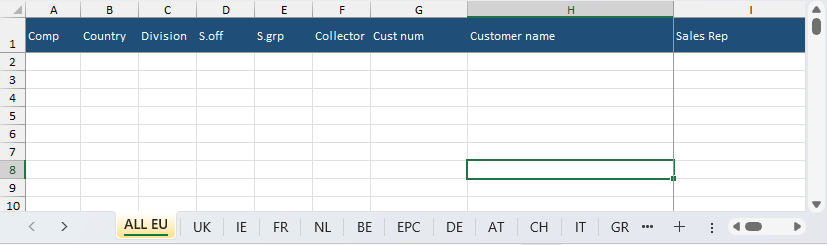

# VBA Aging Report Automation

The purpose of this project was to automate the creation of the monthly aging report and getting it ready for sharing with people within the organization. 
This project reduced working time for this monthly activity from 4h to 30mins.

## Quick overview:

- First of all, **SAP_Report_Consolidation.bas** consolidated a number of 12 reports extracted from SAP into one main file by arranging them and preparing them for further processing
- Secondly, the consolidated reports were processed manually in a main Dashboard file with its own functions for analysis purposes.
- Lastly, the **Aging_Report_Consolidation.bas** arranged the final report in sheets, per country, and got it ready for sharing.

